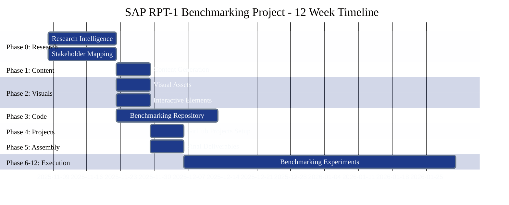
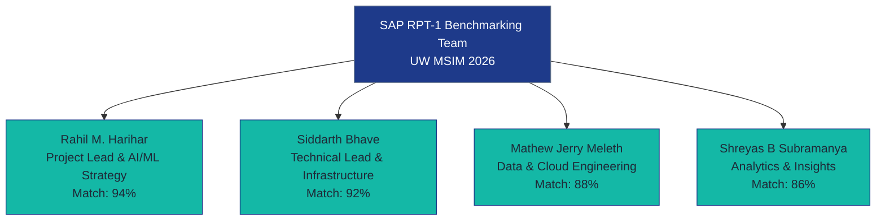
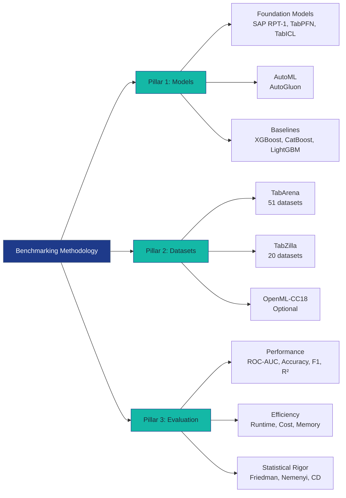
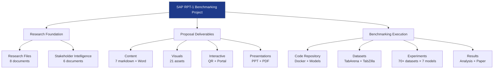
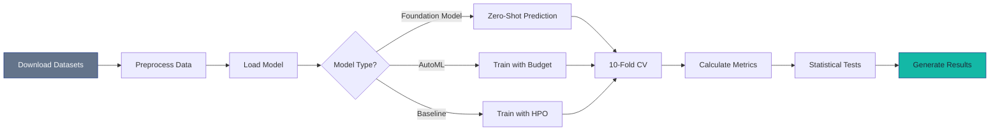
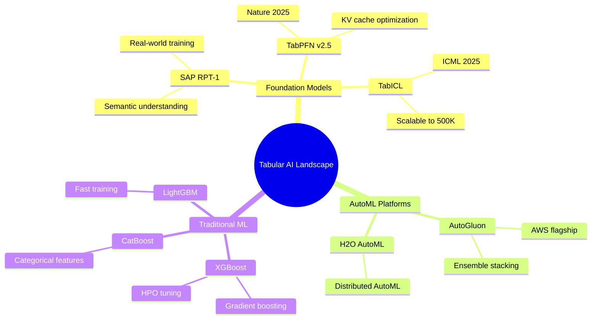

# Visual Assets - Agent 2 (Visual Designer)

**Agent**: Agent 2 - Visual Designer
**Status**: ⏳ Awaiting Deployment
**Dependencies**:
- ✅ Research files complete (research/)
- ⏳ shared-data.json created by Research Agent
- ⏳ Content files created by Agent 1 (READ ONLY)
**Execution Mode**: Parallel with Agent 3 (MUST wait for shared-data.json)

---

## 🎯 Agent 2 Mission

Create **21+ professional-grade visual assets** using Mermaid diagrams, SVG infographics, and charts. All visuals must comply with the design system and achieve BCG/McKinsey quality standards.

**Quality Target**: 9.5/10 professional design
**Design System**: Navy #1E3A8A, Slate #64748B, Teal #14B8A6
**White Space**: 40-50% minimum
**Total Deliverables**: 21+ visual files

---

## 📁 Folder Structure

```
visuals/
├── diagrams/          # Mermaid + SVG (12 files)
├── infographics/      # SVG infographics (4 files)
├── charts/            # Data visualizations (4 files)
└── architecture/      # System diagrams (1 file)
```

---

## 📋 Required Deliverables (21 Files)

### DIAGRAMS (6 Mermaid + 6 SVG = 12 files)

#### 1. Timeline Diagram (Gantt Chart)
**Files**:
- `sap-timeline-diagram-v1.mmd` (Mermaid source)
- `sap-timeline-diagram-v1.svg` (Rendered SVG)

**Content**:
- 12-week project timeline
- 6 phases (Research, Content, Visuals, Code, GitHub, Assembly, Execution)
- Milestones marked
- Color-coded by phase

**Mermaid Template**:


**Data Source**: `content/sap-timeline-milestones-v1.md`, `shared-data.json['timeline']`

---

#### 2. Team Structure Diagram
**Files**:
- `sap-team-structure-v1.mmd`
- `sap-team-structure-v1.svg`

**Content**:
- 4 team members (from KG API)
- Roles for SAP RPT-1 project
- Match scores
- Reporting structure (Rahil as Project Lead)

**Mermaid Template**:


**Data Source**: `shared-data.json['team']`, `research/team-matching.md`

---

#### 3. Methodology Diagram (Three Pillars)
**Files**:
- `sap-methodology-v1.mmd`
- `sap-methodology-v1.svg`

**Content**:
- Three pillars: Models, Datasets, Evaluation
- Each pillar with 3-4 sub-components
- Flow showing how pillars connect

**Mermaid Template**:


**Data Source**: `content/sap-methodology-v1.md`, `project-requirements.json`

---

#### 4. Architecture Diagram (System Components)
**Files**:
- `sap-architecture-v1.mmd`
- `sap-architecture-v1.svg`

**Content**:
- Research foundation
- Content generation
- Visual/interactive assets
- Code repository
- Final deliverables

**Mermaid Template**:


**Data Source**: `START_HERE.md`, `INTEGRATION_CONTRACT.md`

---

#### 5. Benchmarking Workflow Diagram
**Files**:
- `sap-benchmarking-workflow-v1.mmd`
- `sap-benchmarking-workflow-v1.svg`

**Content**:
- Data flow from datasets → models → evaluation → results
- Sequential steps: Download → Preprocess → Experiment → Analyze

**Mermaid Template**:


**Data Source**: `content/sap-methodology-v1.md`

---

#### 6. Competitive Landscape Diagram
**Files**:
- `sap-competitive-landscape-v1.mmd`
- `sap-competitive-landscape-v1.svg`

**Content**:
- Tabular AI landscape
- Foundation models vs. AutoML vs. Traditional ML
- SAP RPT-1 positioning

**Mermaid Template**:


**Data Source**: `research/tabular-ml-landscape.md`

---

### INFOGRAPHICS (4 SVG files)

#### 7. Before/After Infographic
**File**: `sap-before-after-infographic-v1.svg`

**Content**:
Two-column comparison:

**BEFORE (Current State)**:
- ❌ No independent SAP RPT-1 validation
- ❌ Unclear when to use foundation models vs. ML
- ❌ Enterprises lack adoption evidence
- ❌ SAP claims unverified by third parties

**AFTER (With Our Study)**:
- ✅ Publication-quality independent benchmarking
- ✅ Data-driven use case guidance
- ✅ Rigorous competitive comparison
- ✅ Academic validation for SAP's claims

**Design**:
- Navy Blue headers
- Red X (❌) for BEFORE, Green checkmarks (✅) for AFTER
- 50% white space
- Clean, minimal design

**Data Source**: `content/sap-problem-statement-v1.md`, `content/sap-expected-outcomes-v1.md`

---

#### 8. Three Pillars Infographic
**File**: `sap-three-pillars-infographic-v1.svg`

**Content**:
Three columns with icons:

**Pillar 1: MODELS**
- Icon: Neural network symbol
- Foundation Models (3)
- AutoML (1)
- Baselines (3)

**Pillar 2: DATASETS**
- Icon: Database symbol
- TabArena (51)
- TabZilla (20)
- OpenML (optional)

**Pillar 3: EVALUATION**
- Icon: Checkmark/metrics symbol
- Performance metrics
- Efficiency metrics
- Statistical rigor

**Design**:
- Teal accent color for icons
- Navy Blue headers
- Slate Gray body text
- Even column widths

**Data Source**: `content/sap-methodology-v1.md`

---

#### 9. ROI Infographic
**File**: `sap-roi-infographic-v1.svg`

**Content**:
Value breakdown for SAP:

**Market Credibility**: $50K+ consulting equivalent
**Competitive Intelligence**: Positioning vs. TabPFN, AutoGluon
**Use Case Clarity**: Data-driven recommendations
**Feature Roadmap**: Optimization opportunities
**Publication Impact**: Citable academic research

**Design**:
- Dollar amounts in large Teal font
- Benefit descriptions in Slate Gray
- Icons for each category
- Visual hierarchy (size = importance)

**Data Source**: `content/sap-expected-outcomes-v1.md`

---

#### 10. Model Comparison Matrix
**File**: `sap-model-comparison-matrix-v1.svg`

**Content**:
Table comparing 7 models across dimensions:

| Model | Type | Training | Scalability | Interpretability |
|-------|------|----------|-------------|------------------|
| SAP RPT-1 | Foundation | Zero-shot | Medium | Moderate |
| TabPFN | Foundation | Zero-shot | Small data | High |
| TabICL | Foundation | Zero-shot | Large data | Moderate |
| AutoGluon | AutoML | Hours | High | Low |
| XGBoost | Baseline | Minutes-Hours | High | Moderate |

**Design**:
- Header row: Navy Blue background, white text
- Alternating row colors (off-white, pure white)
- Teal highlights for SAP RPT-1 row

**Data Source**: `research/tabular-ml-landscape.md`, `research/sap-rpt-technical-deep-dive.md`

---

### CHARTS (4 files)

#### 11. Market Growth Chart
**File**: `sap-market-growth-chart-v1.svg`

**Content**:
- Line chart or bar chart
- Tabular AI market size: $7.1B (2023) → $48.4B (2030)
- CAGR: 37.8%
- Foundation models adoption trend

**Design**:
- Navy Blue line/bars
- Teal accent for projected growth
- Y-axis: Market size ($B)
- X-axis: Years (2023-2030)

**Data Source**: `research/tabular-ml-landscape.md` (market sizing section)

---

#### 12. Compute Cost Chart
**File**: `sap-compute-cost-chart-v1.svg`

**Content**:
- Bar chart or breakdown visualization
- 3 budget scenarios:
  - Best Case: $500 (credits + Tillicum)
  - Realistic: $2,000 (partial credits)
  - Self-Funded: $3,000 (budget providers)
- Cost components: GPU hours, storage, data transfer

**Design**:
- Stacked bars (color-coded by component)
- Navy Blue, Slate Gray, Teal for components
- Dollar amounts labeled on bars

**Data Source**: `research/compute-resources-guide.md`, `project-requirements.json`

---

#### 13. Performance Benchmark Chart (Mockup)
**File**: `sap-performance-benchmark-chart-v1.svg`

**Content**:
- **PLACEHOLDER/MOCKUP** (actual data from experiments)
- Bar chart showing average accuracy across 51 datasets
- 7 models on X-axis, Accuracy (%) on Y-axis
- Error bars showing std dev

**Design**:
- Model-specific colors (RPT-1: Navy, TabPFN: Teal, etc.)
- Horizontal line at baseline accuracy
- Clean, publication-ready style

**Note**: This is a MOCKUP for the proposal. Real chart created during benchmarking execution.

---

#### 14. Efficiency Analysis Chart (Mockup)
**File**: `sap-efficiency-analysis-chart-v1.svg`

**Content**:
- **PLACEHOLDER/MOCKUP**
- Scatter plot: Accuracy (X) vs. Runtime (Y)
- Each model as a point
- Ideal region (top-left): High accuracy, low runtime

**Design**:
- Color-coded by model family
- Bubble size = cost per prediction
- Quadrants labeled

**Note**: MOCKUP for proposal. Real data from experiments.

---

### ARCHITECTURE DIAGRAMS (1 file)

#### 15. Benchmarking Infrastructure Diagram
**File**: `sap-benchmarking-infrastructure-v1.svg` (in architecture/ folder)

**Content**:
- Cloud providers: UW Tillicum (H200), AWS (A100), Azure
- Compute resources allocation
- Data storage (datasets)
- Code repository (GitHub)
- Results dashboards

**Design**:
- Cloud provider logos (if permissible) or text labels
- Arrows showing data flow
- Navy Blue for primary components
- Teal for connections

**Data Source**: `research/compute-resources-guide.md`

---

## 🎨 Design System Requirements (MANDATORY)

### Color Palette (Exact Hex Codes)

**CRITICAL**: Use these EXACT colors. No variations.

```python
COLORS = {
    # Primary
    "navy_blue": "#1E3A8A",        # Main headings, primary elements
    "slate_gray": "#64748B",        # Body text, secondary elements
    "teal": "#14B8A6",              # Accents, highlights, interactive

    # Background
    "off_white": "#F8FAFC",         # Clean base
    "pure_white": "#FFFFFF",        # Content areas

    # Semantic
    "success_green": "#10B981",     # Checkmarks, positive
    "error_red": "#EF4444",         # X marks, negative
    "info_blue": "#3B82F6"          # Information
}
```

### Typography

**Font Family**: Helvetica Neue, Arial, sans-serif
**Sizes**: 28pt (titles), 24pt (headers), 18pt (subheaders), 14pt (body), 12pt (captions)
**Weights**: Bold (titles), Semibold (headers), Regular (body), Light (captions)

### Mermaid Style Header (MANDATORY)

**EVERY .mmd file MUST start with**:
```javascript
%%{init: {
  'theme': 'base',
  'themeVariables': {
    'primaryColor': '#1E3A8A',
    'primaryTextColor': '#F8FAFC',
    'primaryBorderColor': '#64748B',
    'lineColor': '#14B8A6',
    'secondaryColor': '#64748B',
    'tertiaryColor': '#F8FAFC',
    'fontSize': '14px',
    'fontFamily': 'Helvetica Neue, Arial, sans-serif'
  }
}}%%
```

### SVG Specifications

- **Resolution**: 1920×1080 or 16:9 ratio minimum
- **Format**: SVG (scalable, editable)
- **DPI**: 300 (for print quality if converted to PNG)
- **White Space**: 40-50% of canvas
- **Margins**: Minimum 5% on all sides

---

## 🔄 Wait Protocol (MANDATORY)

Agent 2 MUST wait for shared-data.json before starting:

```python
import os, time, json

def wait_for_shared_data(timeout=300):
    start_time = time.time()
    shared_data_path = "/Users/rahilharihar/TBD-Sponsers/SAP/shared-data.json"

    while not os.path.exists(shared_data_path):
        if time.time() - start_time > timeout:
            raise TimeoutError("shared-data.json not found after 5 minutes")
        print("Waiting for shared-data.json...")
        time.sleep(5)

    # Validate
    with open(shared_data_path) as f:
        data = json.load(f)

    required_keys = ["team", "project", "timeline", "models"]
    for key in required_keys:
        if key not in data:
            raise ValueError(f"Missing key in shared-data.json: {key}")

    print("✅ shared-data.json validated. Proceeding...")
    return data
```

---

## 📦 Output Checklist

### Mermaid Source Files (6 files)
- [ ] sap-timeline-diagram-v1.mmd
- [ ] sap-team-structure-v1.mmd
- [ ] sap-methodology-v1.mmd
- [ ] sap-architecture-v1.mmd
- [ ] sap-benchmarking-workflow-v1.mmd
- [ ] sap-competitive-landscape-v1.mmd

### SVG Renders (6 files from Mermaid + 4 infographics + 4 charts + 1 architecture = 15 files)
- [ ] All .mmd files rendered to .svg
- [ ] sap-before-after-infographic-v1.svg
- [ ] sap-three-pillars-infographic-v1.svg
- [ ] sap-roi-infographic-v1.svg
- [ ] sap-model-comparison-matrix-v1.svg
- [ ] sap-market-growth-chart-v1.svg
- [ ] sap-compute-cost-chart-v1.svg
- [ ] sap-performance-benchmark-chart-v1.svg (mockup)
- [ ] sap-efficiency-analysis-chart-v1.svg (mockup)
- [ ] sap-benchmarking-infrastructure-v1.svg

### Validation
- [ ] All files follow naming convention
- [ ] All Mermaid files have mandatory style header
- [ ] Design system colors used exactly
- [ ] 40-50% white space maintained
- [ ] SVGs are 1920×1080 or 16:9 ratio
- [ ] Professional quality (9.5/10)
- [ ] Total: 21 files created

---

## 🚨 Critical Success Factors

### Must-Do
- ✅ Wait for shared-data.json before starting
- ✅ Use EXACT hex codes from design system
- ✅ Include mandatory style header in ALL .mmd files
- ✅ Maintain 40-50% white space
- ✅ Render all Mermaid to SVG
- ✅ Professional-grade quality

### Must-NOT-Do
- ❌ Start before shared-data.json exists
- ❌ Use approximate colors ("dark blue" vs. #1E3A8A)
- ❌ Skip Mermaid style header
- ❌ Crowd visuals (violate white space rule)
- ❌ Use low resolution (< 1920×1080)
- ❌ Violate file naming conventions

---

## 📊 Quality Standards

**Design Quality**: 9.5/10 (BCG/McKinsey caliber)
**Color Accuracy**: 100% (exact hex codes)
**White Space**: 40-50% minimum
**Resolution**: 1920×1080 or higher
**Total Deliverables**: 21 visual files
**Timeline**: Complete in 1 day (parallel with Agent 3)

---

**Status**: ⏳ Awaiting shared-data.json
**Owner**: Agent 2 (Visual Designer)
**Parallel With**: Agent 3 (Interactive Developer)
**Next Step**: Research Agent creates shared-data.json → Agent 2 deploys
